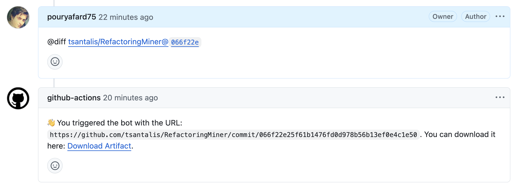

# Refactoringminer-ASTDiff-Exporter


**Refactoringminer-ASTDiff-Exporter** is a GitHub Action that runs RefactoringMiner to generate AST Diff and upload the artifact as .zip file. This tool can be used for analyzing code changes and refactoring between versions in a GitHub repository.

## Features

- Executes RefactoringMiner to generate an AST Diff for any commit or pull request.
- Uploads the diff results as a `.zip` artifact.
- Easy to integrate into your GitHub workflows.

## Usage

### Inputs

| Name       | Description                           | Required |
|------------|---------------------------------------|----------|
| `OAuthToken` | Github OAuthToken for authentication        | Yes      |
| `URL`       | URL of the commit for the diff | Yes      |

### Outputs

| Name         | Description                                     |
|--------------|-------------------------------------------------|
| `artifact_url` | URL to download the generated diff artifact   |
 
Note: You can generate an OAuth token in GitHub Settings -> Developer settings -> Personal access tokens.

### Example Workflow

```yaml
name: Generate AST Diff

on:
  push:
    branches:
      - main

jobs:
  generate-diff:
    runs-on: ubuntu-latest

    steps:
      - name: Run ASTDiff Bot
        uses: pouryafard75/refactoringminer-astdiff-exporter@v0.4
        with:
          OAuthToken: ${{ secrets.GITHUB_TOKEN }}
          URL: https://github.com/your-username/your-repository/commit/SHA

```

## Interesting Use Cases
- Creating a diff-bot that monitors issues (or even PRs) and generates the AST Diff as an artifact.

Below is an example of a bot that listens for the `@diff` keyword in issue comments and generates the corresponding artifact.

```yaml
name: ASTDiff Bot

on:
  issue_comment:
    types: [created]

jobs:
  diff:
    runs-on: ubuntu-latest
    permissions:
      issues: write

    steps:
      # Step 0: Check for @diff trigger and get the URL command
      - name: Check for @diff trigger
        id: trigger
        uses: actions/github-script@v6
        with:
          script: |
            const commentBody = context.payload.comment.body;
            const regex = /@diff\s+(\S+)/;  // Match the next non-whitespace string after @diff
            const match = commentBody.match(regex);
            if (match) {
              core.setOutput('triggered', 'true');
              core.setOutput('url', match[1].trim()); 
            } else {
              core.setOutput('triggered', 'false');
            }

      # Step 1: Run the exporter
      - name: Running the RM action exporter
        uses: pouryafard75/refactoringminer-astdiff-exporter@v0.4
        id: run_rm_exporter 
        with:
          OAuthToken: ${{ secrets.OAUTHTOKEN }}
          URL: "${{ steps.trigger.outputs.url }}"

      # Step 2: Reply to the user with artifact url
      - name: Reply 
        if: ${{ steps.trigger.outputs.triggered == 'true' }}
        uses: actions/github-script@v7
        with:
          script: |
            const url = '${{ steps.trigger.outputs.url }}';
            const artifact_url = '${{ steps.run_rm_exporter.outputs.artifact_url }}'; // Add artifact_url output
            await github.rest.issues.createComment({
              issue_number: context.issue.number,
              owner: context.repo.owner,
              repo: context.repo.repo,
              body: `👋 You triggered the bot with the URL: \`${url}\`. You can download it here: [Download Artifact](${artifact_url}).`
              
            })
            
```

And then you can trigger the bot with @diff comamnd in the issues:


